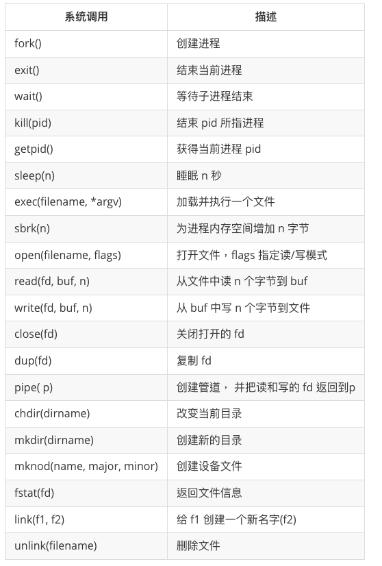

## 一些重要系统调用
进程通过系统调用使用内核服务。系统调用会进入内核，让内核执行服务然后返回。所以进程总是在用户空间和内核空间之间交替运行。


内核使用了 CPU 的硬件保护机制来保证用户进程只能访问自己的内存空间。内核拥有实现保护机制所需的硬件权限(hardware privileges)，而用户程序没有这些权限。当一个用户程序进行一次系统调用时，硬件会提升特权级并且开始执行一些内核中预定义的功能。





## 进程和内存

一个 xv6 进程由两部分组成，一部分是用户内存空间（指令，数据，栈），另一部分是仅对内核可见的进程状态。xv6 提供了分时特性：它在可用 CPU 之间不断切换，决定哪一个等待中的进程被执行。当一个进程不在执行时，xv6 保存它的 CPU 寄存器，当他们再次被执行时恢复这些寄存器的值。内核将每个进程和一个 pid (process identifier) 关联起来。

一个进程可以通过系统调用 fork 来创建一个新的进程。fork 创建的新进程被称为子进程，子进程的内存内容同创建它的进程（父进程）一样。fork 函数在父进程、子进程中都返回（一次调用两次返回）。对于父进程它返回子进程的 pid，对于子进程它返回 0。

## IO和文件描述符

文件描述符是一个整数，它代表了一个进程可以读写的被内核管理的对象。进程可以通过多种方式获得一个文件描述符，如打开文件、目录、设备，或者创建一个管道（pipe），或者复制已经存在的文件描述符。简单起见，我们常常把文件描述符指向的对象称为“文件”。文件描述符的接口是对文件、管道、设备等的抽象，这种抽象使得它们看上去就是字节流。

每个进程都有一张表，而 xv6 内核就以文件描述符作为这张表的索引，所以每个进程都有一个从0开始的文件描述符空间。按照惯例，进程从文件描述符0读入（标准输入），从文件描述符1输出（标准输出），从文件描述符2输出错误（标准错误输出）。我们会看到 shell 正是利用了这种惯例来实现 I/O 重定向。shell 保证在任何时候都有3个打开的文件描述符（8007），他们是控制台（console）的默认文件描述符。

文件描述符和 fork 的交叉使用使得 I/O 重定向能够轻易实现。fork 会复制父进程的文件描述符和内存，所以子进程和父进程的文件描述符一模一样。exec 会替换调用它的进程的内存但是会保留它的文件描述符表。这种行为使得 shell 可以这样实现重定向：fork 一个进程，重新打开指定文件的文件描述符，然后执行新的程序。下面是一个简化版的 shell 执行 cat input.txt 的代码:

```C
char *argv[2];
argv[0] = "cat";
argv[1] = 0;
if(fork() == 0) {
    close(0);
    open("input.txt", O_RDONLY);
    exec("cat", argv);
}
```
子进程关闭文件描述符0后，我们可以保证open 会使用0作为新打开的文件 input.txt的文件描述符（因为0是 open 执行时的最小可用文件描述符）。之后 cat 就会在标准输入指向 input.txt 的情况下运行。

虽然 fork 复制了文件描述符，但每一个文件当前的偏移仍然是在父子进程之间共享的，考虑下面这个例子：

```C
if(fork() == 0) {
    write(1, "hello ", 6);
    exit();
} else {
    wait();
    write(1, "world\n", 6);
}
```

在这段代码的结尾，绑定在文件描述符1上的文件有数据"hello world"，父进程的 write 会从子进程 write 结束的地方继续写 (因为 wait ,父进程只在子进程结束之后才运行 write)。这种行为有利于顺序执行的 shell 命令的顺序输出.

dup 复制一个已有的文件描述符，返回一个指向同一个输入/输出对象的新描述符。这两个描述符共享一个文件偏移，正如被 fork 复制的文件描述符一样。这里有另一种打印 “hello world” 的办法：

```C
fd = dup(1);
write(1, "hello", 6);
write(fd, "world\n", 6);
```

从同一个原初文件描述符通过一系列 fork 和 dup 调用产生的文件描述符都共享同一个文件偏移，而其他情况下产生的文件描述符就不是这样了，即使他们打开的都是同一份文件。

## 管道

管道是一个小的内核缓冲区，它以文件描述符对的形式提供给进程，一个用于写操作，一个用于读操作。从管道的一端写的数据可以从管道的另一端读取。管道提供了一种进程间交互的方式。

```C
int p[2];
char *argv[2];
argv[0] = "wc";
argv[1] = 0;
pipe(p);
if(fork() == 0) {
    close(0);
    dup(p[0]);
    close(p[0]);
    close(p[1]);
    exec("/bin/wc", argv);
} else {
    write(p[1], "hello world\n", 12);
    close(p[0]);
    close(p[1]);
}
```
这段程序调用 pipe，创建一个新的管道并且将读写描述符记录在数组 p 中。在 fork 之后，父进程和子进程都有了指向管道的文件描述符。子进程将管道的读端口拷贝在描述符0上，关闭 p 中的描述符，然后执行 wc。当 wc 从标准输入读取时，它实际上是从管道读取的。父进程向管道的写端口写入然后关闭它的两个文件描述符。

如果数据没有准备好，那么对管道执行的read会一直等待，直到有数据了或者其他绑定在这个管道写端口的描述符都已经关闭了。在后一种情况中，read 会返回 0，就像是一份文件读到了最后。读操作会一直阻塞直到不可能再有新数据到来了，这就是为什么我们在执行 wc 之前要关闭子进程的写端口。如果 wc 指向了一个管道的写端口，那么 wc 就永远看不到 eof 了。

dup() 函数是 Unix/Linux 系统调用，它用于复制文件描述符。这个函数会复制一个现有文件描述符，返回一个新的文件描述符，该描述符指向与原来的文件描述符相同的文件、管道或套接字等。这样做的好处是可以在同一个进程中使用多个文件描述符来访问同一个资源。

在这段代码中，dup() 函数被用来将管道的读取端复制到标准输入（文件描述符 0）上。步骤如下：

关闭标准输入：close(0); 这行代码关闭了标准输入（文件描述符 0）。
复制管道读取端到标准输入：dup(p[0]); 这行代码使用 dup() 函数将管道的读取端复制到刚刚关闭的标准输入文件描述符 0 上。现在文件描述符 0 指向了管道的读取端。
close(p[0]); 关闭不再需要的管道读取端文件描述符。
close(p[1]); 关闭不再需要的管道写入端文件描述符。
这样，在执行 exec() 后，子进程的标准输入（文件描述符 0）已经指向了管道的读取端，因此 wc 命令会从这个管道中读取数据进行处理，而不是从键盘或其他输入流中获取数据。

