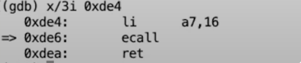

## Trap 机制

每当:
- 程序执行系统调用
- 程序出现了类似page fault、运算时除以0的错误
- 一个设备触发了中断使得当前程序运行需要响应内核设备驱动

都会发生用户空间和内核空间的切换.

这里用户空间和内核空间的切换通常被称为trap，而trap涉及了许多小心的设计和重要的细节，这些细节对于实现安全隔离和性能来说非常重要。因为很多应用程序，要么因为系统调用，要么因为page fault，都会频繁的切换到内核中。所以，trap机制要尽可能的简单，这一点非常重要。

我们需要清楚如何让程序的运行，从只拥有user权限并且位于用户空间的Shell，切换到拥有supervisor权限的内核。在这个过程中，硬件的状态将会非常重要，因为我们很多的工作都是将硬件从适合运行用户应用程序的状态，改变到适合运行内核代码的状态。
### 寄存器
我们最关心的状态可能是32个用户寄存器，这在上节课中有介绍。RISC-V总共有32个比如a0，a1这样的寄存器，用户应用程序可以使用全部的寄存器，并且使用寄存器的指令性能是最好的。

其中一个特别有意思的寄存器是stack pointer（也叫做堆栈寄存器 stack register）。所以，我们有了包含堆栈寄存器在内的这32个寄存器。

此外，
- 在硬件中还有一个寄存器叫做程序计数器（Program Counter Register）。
- 表明当前mode的标志位，这个标志位表明了当前是supervisor mode还是user mode。当我们在运行Shell的时候，自然是在user mode。
- 还有一堆控制CPU工作方式的寄存器，比如SATP（Supervisor Address Translation and Protection）寄存器，它包含了指向page table的物理内存地址（详见4.3）。
- 还有一些对于今天讨论非常重要的寄存器，比如STVEC（Supervisor Trap Vector Base Address Register）寄存器，它指向了内核中处理trap的指令的起始地址。
- SEPC（Supervisor Exception Program Counter）寄存器，在trap的过程中保存程序计数器的值。
- SSRATCH（Supervisor Scratch Register）寄存器，这也是个非常重要的寄存器（详见6.5）。
这些寄存器表明了执行系统调用时计算机的状态。

### trap 之前的操作
可以肯定的是，在trap的最开始，CPU的所有状态都设置成运行用户代码而不是内核代码。在trap处理的过程中，我们实际上需要更改一些这里的状态，或者对状态做一些操作。这样我们才可以运行系统内核中普通的C程序。接下来我们先来预览一下需要做的操作：

- 首先，我们需要保存32个用户寄存器。因为很显然我们需要恢复用户应用程序的执行，尤其是当用户程序随机的被设备中断所打断时。我们希望内核能够响应中断，之后在用户程序完全无感知的情况下再恢复用户代码的执行。所以这意味着32个用户寄存器不能被内核弄乱。但是这些寄存器又要被内核代码所使用，所以在trap之前，你必须先在某处保存这32个用户寄存器。
- 程序计数器也需要在某个地方保存，它几乎跟一个用户寄存器的地位是一样的，我们需要能够在用户程序运行中断的位置继续执行用户程序。
- 我们需要将mode改成supervisor mode，因为我们想要使用内核中的各种各样的特权指令。
- SATP寄存器现在正指向user page table，而user page table只包含了用户程序所需要的内存映射和一两个其他的映射，它并没有包含整个内核数据的内存映射。所以在运行内核代码之前，我们需要将SATP指向kernel page table。
- 我们需要将堆栈寄存器指向位于内核的一个地址，因为我们需要一个堆栈来调用内核的C函数。
- 一旦我们设置好了，并且所有的硬件状态都适合在内核中使用， 我们需要跳入内核的C代码。


一旦我们运行在内核的C代码中，那就跟平常的C代码是一样的。之后我们会讨论内核通过C代码做了什么工作，但是今天的讨论是如何从将程序执行从用户空间切换到内核的一个位置，这样我们才能运行内核的C代码。


### 安全 透明
操作系统的一些high-level的目标能帮我们过滤一些实现选项。其中一个目标是安全和隔离，我们不想让用户代码介入到这里的user/kernel切换，否则有可能会破坏安全性。

所以这意味着，trap中涉及到的硬件和内核机制不能依赖任何来自用户空间东西。比如说我们不能依赖32个用户寄存器，它们可能保存的是恶意的数据，所以，XV6的trap机制不会查看这些寄存器，而只是将它们保存起来。

在操作系统的trap机制中，我们仍然想保留隔离性并防御来自用户代码的可能的恶意攻击。同样也很重要的是，另一方面，我们想要让trap机制对用户代码是透明的，也就是说我们想要执行trap，然后在内核中执行代码，同时用户代码并不用察觉到任何有意思的事情。

这样也更容易写用户代码。需要注意的是，虽然我们这里关心隔离和安全，但是今天我们只会讨论从用户空间切换到内核空间相关的安全问题。当然，系统调用的具体实现，比如说write在内核的具体实现，以及内核中任何的代码，也必须小心并安全的写好。所以，即使从用户空间到内核空间的切换十分安全，整个内核的其他部分也必须非常安全，并时刻小心用户代码可能会尝试欺骗它。

### mode 标志寄存器

在前面介绍的寄存器中，有一个特殊的寄存器我想讨论一下，也就是mode标志位。这里的mode表明当前是user mode还是supervisor mode。

当然，当我们在用户空间时，这个标志位对应的是user mode，当我们在内核空间时，这个标志位对应supervisor mode。

但是有一点很重要：当这个标志位从user mode变更到supervisor mode时，我们能得到什么样的权限。

实际上，这里获得的额外权限实在是有限。也就是说，你可以在supervisor mode完成，但是不能在user mode完成的工作，或许并没有你想象的那么有特权。所以，我们接下来看看supervisor mode可以控制什么？

### supervisor mode 可以干什么
其中的一件事情是，你现在可以读写控制寄存器了。比如说，当你在supervisor mode时，你可以：读写SATP寄存器，也就是page table的指针；STVEC，也就是处理trap的内核指令地址；SEPC，保存当发生trap时的程序计数器；SSCRATCH等等。在supervisor mode你可以读写这些寄存器，而用户代码不能做这样的操作。

另一件事情supervisor mode可以做的是，它可以使用PTE_U标志位为0的PTE。当PTE_U标志位为1的时候，表明用户代码可以使用这个页表；如果这个标志位为0，则只有supervisor mode可以使用这个页表。我们接下来会看一下为什么这很重要。

这两点就是supervisor mode可以做的事情，除此之外就不能再干别的事情了。


需要特别指出的是，supervisor mode中的代码并不能读写任意物理地址。在supervisor mode中，就像普通的用户代码一样，也需要通过page table来访问内存。如果一个虚拟地址并不在当前由SATP指向的page table中，又或者SATP指向的page table中PTE_U=1，那么supervisor mode不能使用那个地址。所以，即使我们在supervisor mode，我们还是受限于当前page table设置的虚拟地址。
所以，这就是全部了。在supervisor我们只能做这些事情，我们接下来会看一下，当我们进入到内核空间时，trap代码的执行流程。

## trap 代码执行流程

我首先会简单介绍一下trap代码的执行流程，但是这节课大部分时间都会通过gdb来跟踪代码是如何通过trap进入到内核空间，这里会涉及到很多的细节。为了帮助你提前了解接下来的内容，我们会跟踪如何在Shell中调用write系统调用。从Shell的角度来说，这就是个Shell代码中的C函数调用，但是实际上，write通过执行ECALL指令来执行系统调用。ECALL指令会切换到具有supervisor mode的内核中。在这个过程中，内核中执行的第一个指令是一个由汇编语言写的函数，叫做uservec。这个函数是内核代码trampoline.s文件的一部分。所以执行的第一个代码就是这个uservec汇编函数。


学生提问：这个问题或许并不完全相关，read和write系统调用，相比内存的读写，他们的代价都高的多，因为它们需要切换模式，并来回捣腾。有没有可能当你执行打开一个文件的系统调用时， 直接得到一个page table映射，而不是返回一个文件描述符？这样只需要向对应于设备的特定的地址写数据，程序就能通过page table访问特定的设备。你可以设置好限制，就像文件描述符只允许修改特定文件一样，这样就不用像系统调用一样在用户空间和内核空间来回捣腾了。


Robert教授：这是个很好的想法。实际上很多操作系统都提供这种叫做内存映射文件（Memory-mapped file access）的机制，在这个机制里面通过page table，可以将用户空间的虚拟地址空间，对应到文件内容，这样你就可以通过内存地址直接读写文件。实际上，你们将在mmap 实验中完成这个机制。对于许多程序来说，这个机制的确会比直接调用read/write系统调用要快的多。

## ECALL 指令之前的(寄存器)的状态

```C
.global write
write:
 li a7, SYS_write
 ecall
 ret
```

上面这几行代码就是实际被调用的write函数的实现。这是个非常短的函数，它首先将SYS_write加载到a7寄存器，SYS_write是常量16。

这里告诉内核，我想要运行第16个系统调用，而这个系统调用正好是write。之后这个函数中执行了ecall指令，从这里开始代码执行跳转到了内核。内核完成它的工作之后，代码执行会返回到用户空间，继续执行ecall之后的指令，也就是ret，最终返回到Shell中。所以ret从write库函数返回到了Shell中。

```C
0000000000000e06 <write>:
.global write
write:
 li a7, SYS_write
     e06:	48c1                	li	a7,16
 ecall
     e08:	00000073          	ecall
 ret
     e0c:	8082                	ret
```

为了展示这里的系统调用，我会在ecall指令处放置一个断点，为了能放置断点，我们需要知道ecall指令的地址，我们可以通过查看由XV6编译过程产生的sh.asm找出这个地址。sh.asm是带有指令地址的汇编代码（注，asm文件3.7有介绍）。我这里会在ecall指令处放置一个断点，这条指令的地址是0xe08。

从gdb可以看出，我们下一条要执行的指令就是ecall。我们来检验一下我们真的在我们以为自己在的位置，让我们来打印程序计数器（Program Counter），正好我们期望在的位置0xe08。

我们还可以输入info reg打印全部32个用户寄存器:


这里有一些数值我们还不知道，也不关心.

但是这里的a0，a1，a2是Shell传递给write系统调用的参数:
- 所以a0是文件描述符2；
- a1是Shell想要写入字符串的指针；
- a2是想要写入的字符数。

我们还可以通过打印Shell想要写入的字符串内容，来证明断点停在我们认为它应该停在的位置。

有一件事情需要注意，上图的寄存器中，程序计数器（pc）和堆栈指针（sp）的地址现在都在距离0比较近的地址，这进一步印证了当前代码运行在用户空间，因为用户空间中所有的地址都比较小。但是一旦我们进入到了内核，内核会使用大得多的内存地址。

系统调用的时间点会有大量状态的变更，其中一个最重要的需要变更的状态，并且在它变更之前我们对它还有依赖的，就是是当前的page table。我们可以查看STAP寄存器。


这里输出的是物理内存地址，它并没有告诉我们有关page table中的映射关系是什么，page table长什么样。但是幸运的是，在QEMU中有一个方法可以打印当前的page table。从QEMU界面，输入ctrl a + c可以进入到QEMU的console，之后输入info mem，QEMU会打印完整的page table。


这是个非常小的page table，它只包含了6条映射关系。这是用户程序Shell的page table，而Shell是一个非常小的程序，这6条映射关系是有关Shell的指令和数据，以及一个无效的page用来作为guard page，以防止Shell尝试使用过多的stack page。

我们可以看出这个page是无效的，因为在attr这一列它并没有设置u标志位（第三行）。attr这一列是PTE的标志位，第三行的标志位是rwx表明这个page可以读，可以写，也可以执行指令。之后的是u标志位，它表明PTE_u标志位是否被设置，用户代码只能访问u标志位设置了的PTE。再下一个标志位我也不记得是什么了（注，从4.3可以看出，这个标志位是Global）。再下一个标志位是a（Accessed），表明这条PTE是不是被使用过。再下一个标志位d（Dirty）表明这条PTE是不是被写过。

现在，我们有了这个小小的page table。顺便说一下，最后两条PTE的虚拟地址非常大，非常接近虚拟地址的顶端，如果你读过了XV6的书，你就知道这两个page分别是trapframe page和trampoline page。你可以看到，它们都没有设置u标志，所以用户代码不能访问这两条PTE。一旦我们进入到了supervisor mode，我们就可以访问这两条PTE了。


对于这里page table，有一件事情需要注意：它并没有包含任何内核部分的地址映射，这里既没有对于kernel data的映射，也没有对于kernel指令的映射。除了最后两条PTE，这个page table几乎是完全为用户代码执行而创建，所以它对于在内核执行代码并没有直接特殊的作用。


接下来，我会在Shell中打印出write函数的内容。



程序计数器现在指向ecall指令，我们接下来要执行ecall指令。现在我们还在用户空间，但是马上我们就要进入内核空间了。

## ECALL 指令之后的状态

现在执行 ecall 指令:

第一个问题，执行完了ecall之后我们现在在哪？我们可以打印程序计数器（Program Counter）来查看。


可以看到程序计数器的值变化了，之前我们的程序计数器还在一个很小的地址0xde6，但是现在在一个大得多的地址。

我们还可以查看page table，我通过在QEMU中执行info mem来查看当前的page table，可以看出，这还是与之前完全相同的page table，所以page table没有改变。


根据现在的程序计数器，代码正在trampoline page的最开始，这是用户内存中一个非常大的地址。所以现在我们的指令正运行在内存的trampoline page中。我们可以来查看一下现在将要运行的指令。


这些指令是内核在supervisor mode中将要执行的最开始的几条指令，也是在trap机制中最开始要执行的几条指令。

因为gdb有一些奇怪的行为，我们实际上已经执行了位于trampoline page最开始的一条指令（注，也就是csrrw指令），我们将要执行的是第二条指令。

我们可以查看寄存器，对比6.3中的图可以看出，寄存器的值并没有改变，这里还是用户程序拥有的一些寄存器内容。


所以，现在寄存器里面还都是用户程序的数据，并且这些数据也还只保存在这些寄存器中，所以我们需要非常小心，在将寄存器数据保存在某处之前，我们在这个时间点不能使用任何寄存器，否则的话我们是没法恢复寄存器数据的。

如果内核在这个时间点使用了任何一个寄存器，内核会覆盖寄存器内的用户数据，之后如果我们尝试要恢复用户程序，我们就不能恢复寄存器中的正确数据，用户程序的执行也会相应的出错。


学生提问：我想知道csrrw指令是干什么的？

Robert教授：我们过几分钟会讨论这部分。但是对于你的问题的答案是，这条指令交换了寄存器a0和sscratch的内容。这个操作超级重要，它回答了这个问题，内核的trap代码如何能够在不使用任何寄存器的前提下做任何操作。这条指令将a0的数据保存在了sscratch中，同时又将sscratch内的数据保存在a0中。之后内核就可以任意的使用a0寄存器了。

我们现在在这个地址0x3ffffff000，也就是上面page table输出的最后一个page，这是trampoline page。我们现在正在trampoline page中执行程序，这个page包含了内核的trap处理代码。

ecall并不会切换page table，这是ecall指令的一个非常重要的特点。所以这意味着，trap处理代码必须存在于每一个user page table中。

因为ecall并不会切换page table，我们需要在user page table中的某个地方来执行最初的内核代码。而这个trampoline page，是由内核小心的映射到每一个user page table中，以使得当我们仍然在使用user page table时，内核在一个地方能够执行trap机制的最开始的一些指令。

这里的控制是通过STVEC寄存器完成的，这是一个只能在supervisor mode下读写的特权寄存器。在从内核空间进入到用户空间之前，内核会设置好STVEC寄存器指向内核希望trap代码运行的位置。


内核已经事先设置好了STVEC寄存器的内容为0x3ffffff000，这就是trampoline page的起始位置。STVEC寄存器的内容，就是在ecall指令执行之后，我们会在这个特定地址执行指令的原因。

最后，我想提示你们，即使trampoline page是在用户地址空间的user page table完成的映射，用户代码不能写它，因为这些page对应的PTE并没有设置PTE_u标志位。这也是为什么trap机制是安全的。

我一直在告诉你们我们现在已经在supervisor mode了，但是实际上我并没有任何能直接确认当前在哪种mode下的方法。不过我的确发现程序计数器现在正在trampoline page执行代码，而这些page对应的PTE并没有设置PTE_u标志位。所以现在只有当代码在supervisor mode时，才可能在程序运行的同时而不崩溃。所以，我从代码没有崩溃和程序计数器的值推导出我们必然在supervisor mode。

我们是通过ecall走到trampoline page的，而ecall实际上只会改变三件事情：
- 第一，ecall将代码从user mode改到supervisor mode。
- 第二，ecall将程序计数器的值保存在了SEPC寄存器。我们可以通过打印程序计数器看到这里的效果，尽管其他的寄存器还是还是用户寄存器，但是这里的程序计数器明显已经不是用户代码的程序计数器。这里的程序计数器是从STVEC寄存器拷贝过来的值。我们也可以打印SEPC（Supervisor Exception Program Counter）寄存器，这是ecall保存用户程序计数器的地方。这个寄存器里面有熟悉的地址0xde6，这是ecall指令在用户空间的地址。所以ecall至少保存了程序计数器的数值。

- 第三，ecall会跳转到STVEC寄存器指向的指令。

所以现在，ecall帮我们做了一点点工作，但是实际上我们离执行内核中的C代码还差的很远。接下来：
- 我们需要保存32个用户寄存器的内容，这样当我们想要恢复用户代码执行时，我们才能恢复这些寄存器的内容。
- 因为现在我们还在user page table，我们需要切换到kernel page table。
- 我们需要创建或者找到一个kernel stack，并将Stack Pointer寄存器的内容指向那个kernel stack。这样才能给C代码提供栈。
- 我们还需要跳转到内核中C代码的某些合理的位置。


ecall并不会为我们做这里的任何一件事。

当然，我们可以通过修改硬件让ecall为我们完成这些工作，而不是交给软件来完成。并且，我们也将会看到，在软件中完成这些工作并不是特别简单。所以你现在就会问，为什么ecall不多做点工作来将代码执行从用户空间切换到内核空间呢？为什么ecall不会保存用户寄存器，或者切换page table指针来指向kernel page table，或者自动的设置Stack Pointer指向kernel stack，或者直接跳转到kernel的C代码，而不是在这里运行复杂的汇编代码？

实际上，有的机器在执行系统调用时，会在硬件中完成所有这些工作。但是RISC-V并不会，RISC-V秉持了这样一个观点：ecall只完成尽量少必须要完成的工作，其他的工作都交给软件完成。这里的原因是，RISC-V设计者想要为软件和操作系统的程序员提供最大的灵活性，这样他们就能按照他们想要的方式开发操作系统。所以你可以这样想，尽管XV6并没有使用这里提供的灵活性，但是一些其他的操作系统用到了。

所以，ecall尽量的简单可以提升软件设计的灵活性。

学生提问：为什么我们在gdb中看不到ecall的具体内容？或许我错过了，但是我觉得我们是直接跳到trampoline代码的。

Robert教授：ecall只会更新CPU中的mode标志位为supervisor，并且设置程序计数器成STVEC寄存器内的值。在进入到用户空间之前，内核会将trampoline page的地址存在STVEC寄存器中。所以ecall的下一条指令的位置是STVEC指向的地址，也就是trampoline page的起始地址。（注，实际上ecall是CPU的指令，自然在gdb中看不到具体内容）

## uservec 函数

回到XV6和RISC-V，现在程序位于trampoline page的起始，也是uservec函数的起始。我们现在需要做的第一件事情就是保存寄存器的内容。

在RISC-V上，如果不能使用寄存器，基本上不能做任何事情。所以，对于保存这些寄存器，我们有什么样的选择呢？

在一些其他的机器中，我们或许直接就将32个寄存器中的内容写到物理内存中某些合适的位置。

但是我们不能在RISC-V中这样做，因为在RISC-V中，supervisor mode下的代码不允许直接访问物理内存。所以我们只能使用page table中的内容，但是从前面的输出来看，page table中也没有多少内容。

虽然XV6并没有使用，但是另一种可能的操作是，直接将SATP寄存器指向kernel page table，之后我们就可以直接使用所有的kernel mapping来帮助我们存储用户寄存器。这是合法的，因为supervisor mode可以更改SATP寄存器。但是在trap代码当前的位置，也就是trap机制的最开始，我们并不知道kernel page table的地址。

并且更改SATP寄存器的指令，要求写入SATP寄存器的内容来自于另一个寄存器。所以，为了能执行更新page table的指令，我们需要一些空闲的寄存器，这样我们才能先将page table的地址存在这些寄存器中，然后再执行修改SATP寄存器的指令。

对于保存用户寄存器，XV6在RISC-V上的实现包括了两个部分。第一个部分是，XV6在每个user page table映射了trapframe page，这样每个进程都有自己的trapframe page。这个page包含了很多有趣的数据，但是现在最重要的数据是用来保存用户寄存器的32个空槽位。

所以，在trap处理代码中，现在的好消息是，我们在user page table有一个之前由kernel设置好的映射关系，这个映射关系指向了一个可以用来存放这个进程的用户寄存器的内存位置。这个位置的虚拟地址总是0x3ffffffe000。
如果你想查看XV6在trapframe page中存放了什么，这部分代码在proc.h中的trapframe结构体中。


你可以看到很多槽位的名字都对应了特定的寄存器。在最开始还有5个数据，这些是内核事先存放在trapframe中的数据。比如第一个数据保存了kernel page table地址，这将会是trap处理代码将要加载到SATP寄存器的数值。


所以，如何保存用户寄存器的一半答案是，内核非常方便的将trapframe page映射到了每个user page table