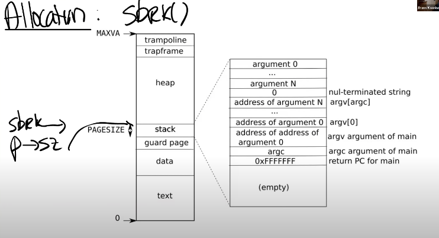
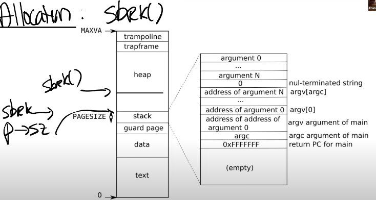

## Page Fault Basics

几乎所有稍微正经的操作系统都实现了这些功能。比如Linux就实现了所有的这些功能。然而在XV6中，实话实说，一个这样的功能都没实现。在XV6中，一旦用户空间进程触发了page fault，会导致进程被杀掉。这是非常保守的处理方式。

在这节课，我们将会探讨在发生page fault时可以做的一些有趣的事情。这节课对于代码的讲解会比较少，相应的在设计层面会有更多的内容，毕竟我们也没有代码可以讲解（因为XV6中没有实现）。

在进入到具体细节之前，我们先来简单回顾一下虚拟内存。你可以认为虚拟内存有两个主要的优点：

- 第一个是Isolation，隔离性。虚拟内存使得操作系统可以为每个应用程序提供属于它们自己的地址空间。所以一个应用程序不可能有意或者无意的修改另一个应用程序的内存数据。虚拟内存同时也提供了用户空间和内核空间的隔离性，我们在之前的课程已经谈过很多相关内容，并且你们通过page table lab也可以理解虚拟内存的隔离性。
- 另一个好处是level of indirection，提供了一层抽象。处理器和所有的指令都可以使用虚拟地址，而内核会定义从虚拟地址到物理地址的映射关系。这一层抽象是我们这节课要讨论的许多有趣功能的基础。不过到目前为止，在XV6中内存地址的映射都比较无聊，实际上在内核中基本上是直接映射（注，也就是虚拟地址等于物理地址）。当然也有几个比较有意思的地方：
- - trampoline page，它使得内核可以将一个物理内存page映射到多个用户地址空间中。
- - guard page，它同时在内核空间和用户空间用来保护Stack。


到目前为止，我们介绍的内存地址映射相对来说比较静态。不管是user page table还是kernel page table，都是在最开始的时候设置好，之后就不会再做任何变动。

page fault可以让这里的地址映射关系变得动态起来。通过page fault，内核可以更新page table，这是一个非常强大的功能。因为现在可以动态的更新虚拟地址这一层抽象，结合page table和page fault，内核将会有巨大的灵活性。

但是在那之前，首先，我们需要思考的是，什么样的信息对于page fault是必须的。或者说，当发生page fault时，内核需要什么样的信息才能够响应page fault。

- 很明显的，我们需要出错的虚拟地址，或者是触发page fault的源。当出现page fault的时候，XV6内核会打印出错的虚拟地址，并且这个地址会被保存在STVAL寄存器中。当出现page fault的时候，XV6内核会打印出错的虚拟地址，并且这个地址会被保存在STVAL寄存器中。

- 我们需要知道的第二个信息是出错的原因，我们或许想要对不同场景的page fault有不同的响应。不同的场景是指，比如因为load指令触发的page fault、因为store指令触发的page fault又或者是因为jump指令触发的page fault。在SCAUSE（注，Supervisor cause寄存器，保存了trap机制中进入到supervisor mode的原因）寄存器的介绍中，有多个与page fault相关的原因。ECALL进入到supervisor mode对应的是8，这是我们在上节课中应该看到的SCAUSE值。基本上来说，page fault和其他的异常使用与系统调用相同的trap机制. 如果是因为page fault触发的trap机制并且进入到内核空间，STVAL寄存器和SCAUSE寄存器都会有相应的值。

- 我们或许想要知道的第三个信息是触发page fault的指令的地址。从上节课可以知道，作为trap处理代码的一部分，这个地址存放在SEPC（Supervisor Exception Program Counter）寄存器中，并同时会保存在trapframe->epc（注，详见lec06）中。

所以，从硬件和XV6的角度来说，当出现了page fault，现在有了3个对我们来说极其有价值的信息，分别是：
- 引起page fault的内存地址
- 引起page fault的原因类型
- 引起page fault时的程序计数器值，这表明了page fault在用户空间发生的位置

我们之所以关心触发page fault时的程序计数器值，是因为在page fault handler中我们或许想要修复page table，并重新执行对应的指令。理想情况下，修复完page table之后，指令就可以无错误的运行了。所以，能够恢复因为page fault中断的指令运行是很重要的。

## Lazy Page Allocation

我们首先来看一下内存allocation，或者更具体的说sbrk。sbrk是XV6提供的系统调用，它使得用户应用程序能扩大自己的heap。当一个应用程序启动的时候，sbrk指向的是heap的最底端，同时也是stack的最顶端。这个位置通过代表进程的数据结构中的sz字段表示，这里以p->sz表示。



```C
uint64 sz;                   // Size of process memory (bytes)
```

当调用sbrk时，它的参数是整数，代表了你想要申请的page数量（注，原视频说的是page，但是根据Linux man page，实际中sbrk的参数是字节数）。sbrk会扩展heap的上边界（也就是会扩大heap）。



这意味着，当sbrk实际发生或者被调用的时候，内核会分配一些物理内存，并将这些内存映射到用户应用程序的地址空间，然后将内存内容初始化为0，再返回sbrk系统调用。这样，应用程序可以通过多次sbrk系统调用来增加它所需要的内存。类似的，应用程序还可以通过给sbrk传入负数作为参数，来减少或者压缩它的地址空间。不过在这节课我们只关注增加内存的场景。

在XV6中，sbrk的实现默认是eager allocation。这表示了，一旦调用了sbrk，内核会立即分配应用程序所需要的物理内存。但是实际上，对于应用程序来说很难预测自己需要多少内存，所以通常来说，应用程序倾向于申请多于自己所需要的内存。这意味着，进程的内存消耗会增加许多，但是有部分内存永远也不会被应用程序所使用到。

你需要为最坏的情况做准备，比如说为最大可能的矩阵分配内存，但是应用程序可能永远也用不上这些内存，通常情况下，应用程序会在一个小得多的矩阵上进行运算。所以，程序员过多的申请内存但是过少的使用内存，这种情况还挺常见的。

原则上来说，这不是一个大问题。但是使用虚拟内存和page fault handler，我们完全可以用某种更聪明的方法来解决这里的问题，这里就是利用lazy allocation。

核心思想非常简单，sbrk系统调基本上不做任何事情，唯一需要做的事情就是提升p->sz，将p->sz增加n，其中n是需要新分配的内存page数量。

但是内核在这个时间点并不会分配任何物理内存。之后在某个时间点，应用程序使用到了新申请的那部分内存，这时会触发page fault，因为我们还没有将新的内存映射到page table。

所以，如果我们解析一个大于旧的p->sz，但是又小于新的p->sz（注，也就是旧的p->sz + n）的虚拟地址，我们希望内核能够分配一个内存page，并且重新执行指令。

所以，当我们看到了一个page fault，相应的虚拟地址小于当前p->sz，同时大于stack，那么我们就知道这是一个来自于heap的地址，但是内核还没有分配任何物理内存。

所以对于这个page fault的响应也理所当然的直接明了：在page fault handler中，通过kalloc函数分配一个内存page；初始化这个page内容为0；将这个内存page映射到user page table中；最后重新执行指令。比方说，如果是load指令，或者store指令要访问属于当前进程但是还未被分配的内存，在我们映射完新申请的物理内存page之后，重新执行指令应该就能通过了。

学生提问：在eager allocation的场景，一个进程可能消耗了太多的内存进而耗尽了物理内存资源。如果我们不使用eager allocation，而是使用lazy allocation，应用程序怎么才能知道当前已经没有物理内存可用了？


Frans教授：这是个非常好的问题。从应用程序的角度来看，会有一个错觉：存在无限多可用的物理内存。但是在某个时间点，应用程序可能会用光了物理内存，之后如果应用程序再访问一个未被分配的page，但这时又没有物理内存，这时内核可以有两个选择，我稍后会介绍更复杂的那个。你们在lazy lab中要做的是，返回一个错误并杀掉进程。因为现在已经OOM（Out Of Memory）了，内核也无能为力，所以在这个时间点可以杀掉进程。

学生提问：如何判断一个地址是新分配的内存还是一个无效的地址？

Frans教授：在地址空间中，我们有stack，data和text。通常来说我们将p->sz设置成一个更大的数，新分配的内存位于旧的p->sz和新的p->sz之间，但是这部分内存还没有实际在物理内存上进行分配。如果使用的地址低于p->sz，那么这是一个用户空间的有效地址。如果大于p->sz，对应的就是一个程序错误，这意味着用户应用程序在尝试解析一个自己不拥有的内存地址。希望这回答了你的问题。


学生提问：为什么我们需要杀掉进程？操作系统不能只是返回一个错误说现在已经OOM了，尝试做一些别的操作吧。

Frans教授：让我们稍后再回答这个问题。在XV6的page fault中，我们默认会直接杀掉进程，但是这里的处理可以更加聪明。实际的操作系统的处理都会更加聪明，尽管如此，如果最终还是找不到可用内存，实际的操作系统还是可能会杀掉进程。

为了进一步理解lazy allocation，我们大概来看一下它的代码会是怎么样？这也是今天唯一编程相关的内容。实际上你可能会感到奇怪，相关的代码是如此的简单。这部分代码介绍对于接下来的lazy lab或许会有很大的帮助。

我们首先要修改的是sys_sbrk函数，sys_sbrk会完成实际增加应用程序的地址空间，分配内存等等一系列相关的操作。

```C
uint64
sys_sbrk(void)
{
  uint64 addr;
  int n;

  argint(0, &n);
  addr = myproc()->sz;
  myproc()->sz = myproc()->sz+n;
  // if(growproc(n) < 0)
  //   return -1;
  return addr;
}
```

```bash
xv6 kernel is booting

hart 2 starting
hart 1 starting
init: starting sh
$ echo hi
usertrap(): unexpected scause 0x000000000000000f pid=3
            sepc=0x00000000000012d8 stval=0x0000000000005008
panic: uvmunmap: not mapped
0x0000000080005e76
0x00000000800007ac
0x0000000080000a34
0x000000008000105a
0x000000008000109e
0x00000000800018fe
0x00000000800021d2
0x0000000080002124
0x0000000080001dbc

```
之所以会得到一个page fault是因为，在Shell中执行程序，Shell会先fork一个子进程，子进程会通过exec执行echo（注，详见1.9）。在这个过程中，Shell会申请一些内存，所以Shell会调用sys_sbrk，然后就出错了（注，因为前面修改了代码，调用sys_sbrk不会实际分配所需要的内存）。


这里输出的内容包含了一些有趣的信息：

- 这里输出了SCAUSE寄存器内容，我们可以看到它的值是15，表明这是一个store page fault（详见8.1）。
- 我们可以看到进程的pid是3，这极可能是Shell的pid。
- 我们还可以看到SEPC寄存器的值，是0x12d8。
- 最后还可以看到出错的虚拟内存地址，也就是STVAL寄存器的内容，是0x5008。
-
我们可以查看Shell的汇编代码，这是由Makefile创建的。我们搜索SEPC对应的地址，可以看到这的确是一个store指令。这看起来就是我们出现page fault的位置。

在lec06中，我们是因为SCAUSE == 8进入的trap，这是我们处理普通系统调用的代码。如果SCAUSE不等于8，接下来会检查是否有任何的设备中断，如果有的话处理相关的设备中断。如果两个条件都不满足，这里会打印一些信息，并且杀掉进程。

现在我们需要增加一个检查，判断SCAUSE == 15，如果符合条件，我们需要一些定制化的处理。我们这里想要做什么样的定制化处理呢？

学生回答：我们想要检查p->sz是否大于当前存在STVAL寄存器中的虚拟地址。如果大于的话，就实际分配物理内存。
这是一种处理方式。这里我会以演示为目的简单的处理一下，在lazy lab中你们需要完成更多的工作。

```C
else if(r_scause() == 15){
    uint64 va = r_stval();
    printf("page fault %p\n",va);
    uint64 ka = (uint64)kalloc();
    if(ka == 0){
      p->killed = 1;
    }else{
      memset((void*)ka,0,PGSIZE);
      va = PGROUNDDOWN(va);
      if(mappages(p->pagetable,va,PGSIZE,ka,PTE_W|PTE_U|PTE_R) != 0){
        kfree((void*)ka);
        p->killed = 1;
      }
    }


```

在上面增加的代码中，首先打印一些调试信息。之后分配一个物理内存page，如果ka等于0，表明没有物理内存我们现在OOM了，我们会杀掉进程。如果有物理内存，首先会将内存内容设置为0，之后将物理内存page指向用户地址空间中合适的虚拟内存地址。具体来说，我们首先将虚拟地址向下取整，这里引起page fault的虚拟地址是0x4008，向下取整之后是0x4000。之后我们将物理内存地址跟取整之后的虚拟内存地址的关系加到page table中。对应的PTE需要设置常用的权限标志位，在这里是u，w，r bit位。
接下来运行一些这部分代码。先重新编译XV6，再执行“echo hi”，我们或许可以乐观的认为现在可以正常工作了。

```C

xv6 kernel is booting

hart 1 starting
hart 2 starting
init: starting sh
$ echo hi
page fault 0x0000000000005008
page fault 0x0000000000014f48
panic: uvmunmap: not mapped

```

但是实际上并没有正常工作。我们这里有两个page fault，第一个对应的虚拟内存地址是0x5008，但是很明显在处理这个page fault时，我们又有了另一个page fault 0x14f48。现在唯一的问题是，uvmunmap在报错，一些它尝试unmap的page并不存在。这里unmap的内存是什么？

学生回答：之前lazy allocation但是又没有实际分配的内存。

是的，完全正确。这里unmap的是之前lazy allocated，但是又还没有用到的地址。所以对于这个内存，并没有对应的物理内存。所以在uvmunmap函数中，当PTE的v标志位为0并且没有对应的mapping，这并不是一个实际的panic，这是我们预期的行为。

实际上，对于这个page我们并不用做任何事情，我们可以直接continue跳到下一个page。

```C
for(a = va; a < va + npages*PGSIZE; a += PGSIZE){
    if((pte = walk(pagetable, a, 0)) == 0)
      panic("uvmunmap: walk");
    if((*pte & PTE_V) == 0)
      // panic("uvmunmap: not mapped");
      continue;
    if(PTE_FLAGS(*pte) == PTE_V)
      panic("uvmunmap: not a leaf");
    if(do_free){
      uint64 pa = PTE2PA(*pte);
      kfree((void*)pa);
    }
    *pte = 0;
  }
```

```bash
xv6 kernel is booting

hart 1 starting
hart 2 starting
init: starting sh
$ echo hi
page fault 0x0000000000005008
page fault 0x0000000000014f48
hi
$
```

现在我们可以看到2个page fault，但是echo hi正常工作了。现在，我们一定程度上有了最基本最简单的lazy allocation。这里有什么问题吗？

学生提问：我并不能理解为什么在uvmunmap中可以直接改成continue？

Frans教授：之前的panic表明，我们尝试在释放一个并没有map的page。怎么会发生这种情况呢？唯一的原因是sbrk增加了p->sz，但是应用程序还没有使用那部分内存。因为对应的物理内存还没有分配，所以这部分新增加的内存的确没有映射关系。我们现在是lazy allocation，我们只会为需要的内存分配物理内存page。如果我们不需要这部分内存，那么就不会存在map关系，这非常的合理。相应的，我们对于这部分内存也不能释放，因为没有实际的物理内存可以释放，所以这里最好的处理方式就是continue，跳过并处理下一个page。

学生提问：在uvmunmap中，我认为之前的panic存在是有理由的，我们是不是应该判断一下，然后对于特定的场景还是panic？

Frans教授：为什么之前的panic会存在？对于未修改的XV6，永远也不会出现用户内存未map的情况，所以一旦出现这种情况需要panic。但是现在我们更改了XV6，所以我们需要去掉这里的panic，因为之前的不可能变成了可能。

这部分内容对于下一个实验有很大的帮助，实际上这是下一个实验3个部分中的一个，但是很明显这部分不足以完成下一个lazy lab。我们这里做了一些修改，但是很多地方还是有可能出错。就像有人提到的，我这里并没有检查触发page fault的虚拟地址是否小于p->sz。还有其他的可能出错的地方吗？

学生回答：通过sbrk增加的用户进程的内存数是一个整型数而不是一个无符号整型数，可能会传入负数。


是的，可能会使用负数，这意味着缩小用户内存。当我们在缩小用户内存时，我们也需要小心一些。实际上，在一个操作系统中，我们可能会在各种各样的用户场景中使用这里的PTE，对于不同的用户场景我们或许需要稍微修改XV6，这就是接下来的lazy lab的内容。你们需要完成足够多的修改，才能通过所有的测试用例。

## Zero Fill On Demand


